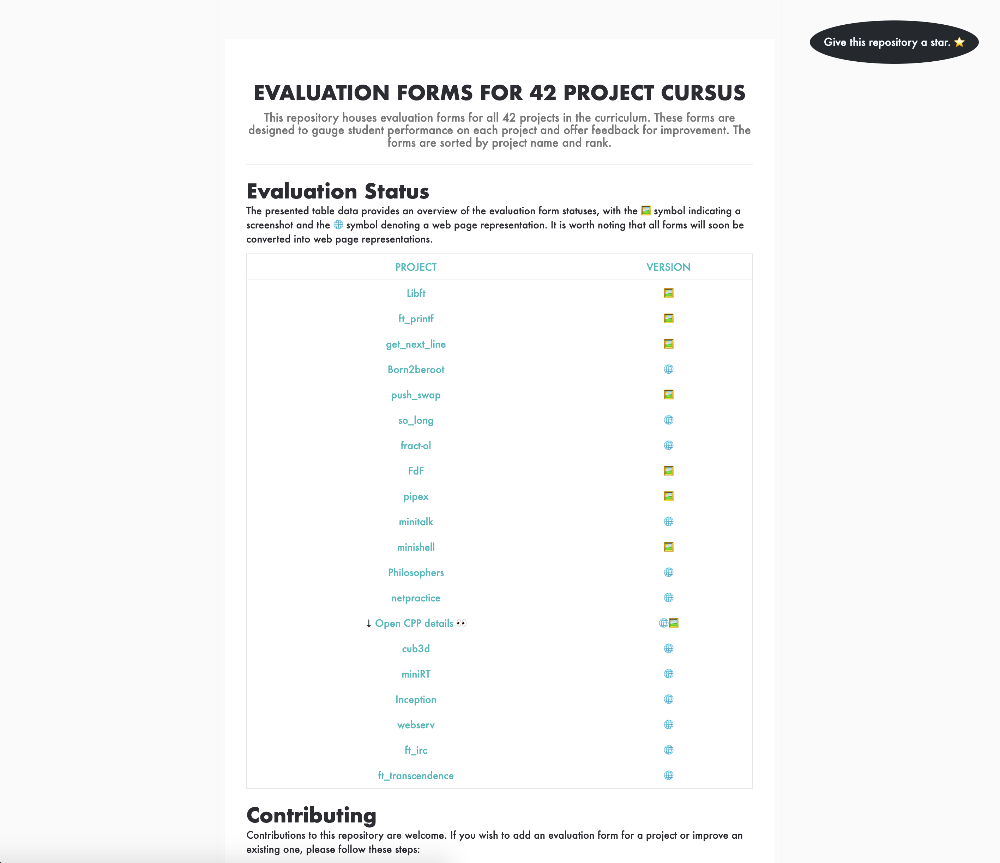

# 42 Project Evaluation Sheets Hub 🎯

Welcome to the heart of self-evaluation for 42 School projects! 📝 Whether you're gearing up for a peer-evaluation or refining your code masterpiece, these sheets offer a sneak peek into the evaluation process, setting you up for success. 🌟

Dive into my meticulously curated evaluation sheets, sourced directly from the official 42 School, and fine-tune your projects to ace that evaluation. For the most immersive experience, check out the [42-Evals Web Page](https://rphlr.github.io/42-Evals) - your digital companion for project assessments, updated regularly for seamless access. 🖥️✨

